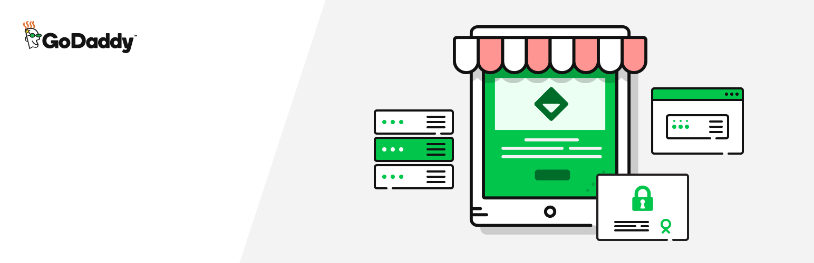

# GoDaddy Reseller Store #


**Contributors:** [godaddy](https://profiles.wordpress.org/godaddy), [fjarrett](https://profiles.wordpress.org/fjarrett), [bfocht](https://profiles.wordpress.org/bfocht), [eherman24](https://profiles.wordpress.org/eherman24)  
**Tags:**              [admin](https://wordpress.org/plugins/tags/admin/), [posts](https://wordpress.org/plugins/tags/posts/), [users](https://wordpress.org/plugins/tags/users/)  
**Requires at least:** 4.6  
**Tested up to:**      4.8  
**Stable tag:**        1.1.3  
**License:**           GPL-2.0  
**License URI:**       https://www.gnu.org/licenses/gpl-2.0.html  

Design your own storefront for your GoDaddy Reseller plan and have more control over your customers experience and business!

[](https://travis-ci.org/godaddy/wp-reseller-store) [](https://coveralls.io/github/godaddy/wp-reseller-store?branch=master) [](https://david-dm.org/godaddy/wp-reseller-store/master?type=dev) [](https://github.com/godaddy/wp-reseller-store/blob/master/license.txt) [](https://secure.php.net/supported-versions.php) [](https://wordpress.org/download/release-archive/)  

## Description ##

**Note: This plugin requires PHP 5.4 or higher**

With this plugin, you have the option to easily design a site with the imported product catalog, complete with your pricing, preferred currency and language. You can update your site, themes, product description, and images, easily and painlessly as well as use key features like domain search and cart widgets!

[](https://www.youtube.com/watch?v=DKFZGitRKek)

**Features**
* Easily design a site that is for desktop or mobile devices in your theme
* Imports product catalog with your pricing in your preferred currency and language
* Update products/descriptions/images
* Easily create pages with different layouts and products on the page
* Add core functions to your site with domain search and cart widgets

**Languages Supported**

English - Dansk - Deutsch - Ελληνικά - Español - Español de México - Suomi - Français - हिन्दी - Bahasa Indonesia - Italiano - 日本語 - 한국어 - मराठी - Bahasa Melayu - Norsk bokmål - Nederlands - Polski - Português do Brasil - Português - Русский - Svenska - ไทย - Tagalog - Türkçe - Українська - Tiếng Việt - 简体中文 - 香港中文版 - 繁體中文

**Support**

If you run into a problem, post your question in [UserVoice](https://godaddy.uservoice.com/forums/598645-reseller-custom-storefront) or send an email to resellersupport@godaddy.com and we would be happy to help. Remember, the more information you can provide up-front, the easier it is for us to verify the problem and the faster we can help!
    * Screenshot(s) - How-to guide
    * Name and version of your theme - Video tutorial
    * List of all active plugins on your site - Video tutorial
    * Steps taken or details we should know to reproduce and verify the problem

You can call our support team at (480) 505-8857

**Contributing**

Development of this plugin is done on [GitHub](https://github.com/godaddy/wp-reseller-store). If you believe you have found a bug, or have a killer feature idea, please open a [open a new issue](https://github.com/godaddy/wp-reseller-store/issues) there. Pull requests on existing issues are also welcome!

## Frequently Asked Questions ##

### What reseller programs will this plugin work with? ###
This plugin is designed for the [GoDaddy Reseller Program](https://www.godaddy.com/reseller-program). If you have not purchased a reseller program, you can activate the plugin with our "in house" reseller. At any time, you can updgrade the reseller to your own.

### What settings should I update in the Reseller Control Center? ###
We recommend you set the _Home Url_ to your WordPress storefront. We also suggest you set up a _Custom Domain_ and point the DNS to our server.
The _Custom Domain_ must be on a subdomain that matches the same root domain of your WordPress storefront. For example, your WordPress storefront is hosted on _www_ and your custom domain is hosted on _shop_. Follow these instructions to set your custom domain. https://www.godaddy.com/help/use-a-custom-domain-for-my-storefront-5040

You can update both the home url and custom domain setting at https://reseller.godaddy.com/settings/branding

### How do I set the currency and language for the product catalog? ###
The currency and language are set in the [Reseller Control Center](https://http://reseller.godaddy.com)

### Do you have a pre-built WordPress site? ###
We encourage each reseller to create their own unique site and content for their storefronts. This provides a better experience for your customers and more opportunities for search engine optimization.
While we can't test every theme with our plugin, we try our best to make the plugin compatible. GoDaddy provides several free themes including [Primer](https://wordpress.org/themes/primer/) and [Activation](https://wordpress.org/themes/activation/) that we test with our plugin. You can use content from the turnkey website to help you build your own WordPress site.

### I am getting an error while trying to activate the plugin. What should I do? ###
If you are having an issue, we recommend you deactivate your other plugins and then try to activate the Reseller Store plugin. You can also try changing to another theme and the try re activating the plugin. Before making any of these changes, we recommend you make a backup of your site and database.

While we strive to make the plugin compatible with many themes and plugins, our plugin creates a custom post type which can cause some themes and custom builder plugins to interfere with the registration of the custom post type.

### What shortcodes are supported? ###
While we recommend you use our widgets for your storefront, we do have a shortcodes for each widget.
#### Domain Search
```
[rstore_domain_search page_size="5" text_placeholder="Find your perfect domain name" text_search="Search" text_available="Congrats, your domain is available!" text_not_available="Sorry that domain is taken" text_cart="Continue to Cart" text_select="Select" text_selected="Selected" text_verify="Verify" ]
```
#### View Cart Button
```
[rstore_cart_button title="Cart" button_label="View Cart" ]
```
#### Product Pod
```
[rstore_product post_id=10 show_title=1 show_content=1 show_price=1 redirect=1 button_label="Add to cart" text_cart="Continue to cart" image_size="original" ]
```
#### Log in/out Button
```
[rstore_login welcome_message="Welcome Back" login_button_text="Log In" logout_button_text="Log Out" ]
```


## Changelog ##

### 1.1.1 - November 2017 ###

* Fix: Compatibility issues with Page Builder by SiteOrigin
* New: Add Product Options to Edit Product Screen
* Tweak: Moved reset button meta box to Product Options

### 1.1.0 - October 2017 ###

* New: Import tags
* Update: Domain search widget 2.1.0
* Fix: Issue with shortcodes and Visual Composer
* New: Add `rstore_api_query_args` filter
* Remove: `rstore_api_currency` and `rstore_api_market_id` filters
* New: Add Reset button to product page
* Tweak: Add span tags to product pricing
* New: Add empty index.php to every directory

### 1.0.3 - August 2017 ###

*  New: Shopper login widget
*  New: Add more options including _cart redirect_ to the product widget
*  New: Move shortcodes to a new class and add new shortcodes.
*  Fix: No longer store cart count in a cookie
*  Fix: Image size on the product widget
*  Fix: Display error if post id cannot be found on product widget
*  Fix: No longer remove html from widget labels

### 1.0.0 - July 2017 ###

* New: Plugin activation is easier with integration of the [Reseller Control Center](https://reseller.godaddy.com)
* New: Add Product Widget
* New: Add demo reseller
* New: Add product widget
* New: Unit tests
* New: Add filters for language and currency settings
* New: Localization settings are now set in the [Reseller Control Center](https://reseller.godaddy.com)
* Tweak: Default language and currency settings from the RCC instead of WordPress user settings
* Tweak: Don't delete posts on uninstall
* Tweak: Language updates
* Fix: Show full post for embedded custom post type
* Fix: No longer delete custom posts on uninstall of plugin
* Fix: Pressing the "Enter" key now properly triggers a domain search

Props [@fjarrett](https://github.com/fjarrett), [@bfocht](https://github.com/bfocht), [@evanherman](https://github.com/EvanHerman), [@cberesford](https://github.com/cberesford)

### 0.2.0 - April 2017 ###

* New: Domain search shortcode
* Tweak: Verify setup JS is enqueued
* Fix: Stop using `INPUT_SERVER` as it is unreliable in FastCGI mode
* Fix: Post meta not updating after sync
* Fix: WordPress coding standards updates
* Fix: Do admin referrer check on Permalinks save

Props [@fjarrett](https://github.com/fjarrett), [@bfocht](https://github.com/bfocht), [@evanherman](https://github.com/EvanHerman)

### 0.1.0 - January 2017 ###

* Initial release

Props [@fjarrett](https://github.com/fjarrett), [@bfocht](https://github.com/bfocht)
